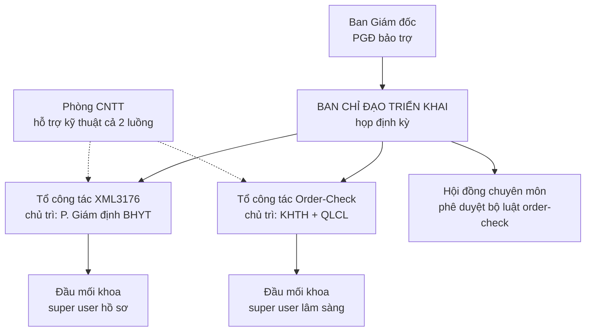
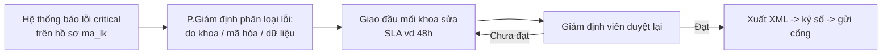
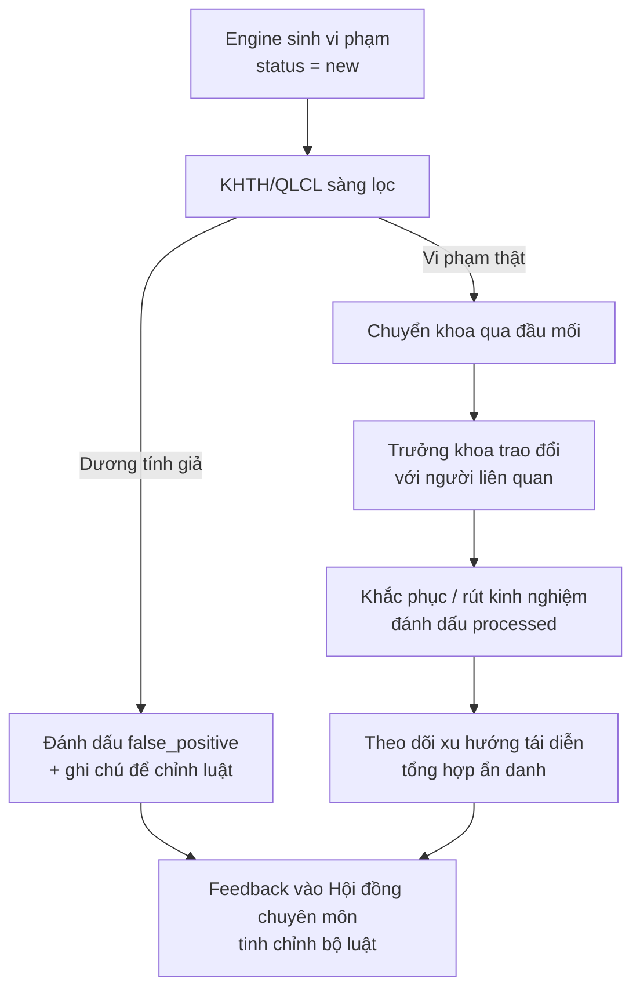

# Quy trình quản lý triển khai (con người) — Hệ thống XML3176 & Order-Check tại Bệnh viện Bạch Mai

> Tài liệu tập trung vào **quản lý con người và tổ chức** khi triển khai hai module:
> Tiền giám định XML3176 và Kiểm tra sai sót y lệnh (Order-Check).
> Không phải tài liệu kỹ thuật — phần kỹ thuật xem `docs/quy-trinh-tien-giam-dinh-3176-va-order-check.md`.
>
> **Phương án đã chọn:** triển khai **song song cả hai module**.
> **Chính sách order-check:** **No-blame tuyệt đối** (dữ liệu vi phạm chỉ dùng để hiệu chỉnh
> luật và cải tiến quy trình, **không bao giờ** gắn với đánh giá/kỷ luật cá nhân).
>
> Cập nhật: 2026-07-23.

---

## Mục lục

1. [Bối cảnh & nguyên tắc nền tảng](#1-bối-cảnh--nguyên-tắc-nền-tảng)
2. [Chính sách No-blame tuyệt đối (bắt buộc đọc)](#2-chính-sách-no-blame-tuyệt-đối-bắt-buộc-đọc)
3. [Bộ máy quản trị triển khai](#3-bộ-máy-quản-trị-triển-khai)
4. [Bản đồ các bên liên quan](#4-bản-đồ-các-bên-liên-quan)
5. [Quản trị "quyền sở hữu quy tắc"](#5-quản-trị-quyền-sở-hữu-quy-tắc)
6. [SOP nghiệp vụ — Module XML3176](#6-sop-nghiệp-vụ--module-xml3176)
7. [SOP nghiệp vụ — Module Order-Check](#7-sop-nghiệp-vụ--module-order-check)
8. [Ma trận trách nhiệm RACI](#8-ma-trận-trách-nhiệm-raci)
9. [Lộ trình triển khai song song](#9-lộ-trình-triển-khai-song-song)
10. [Đào tạo & truyền thông](#10-đào-tạo--truyền-thông)
11. [Đo lường hiệu quả (KPI)](#11-đo-lường-hiệu-quả-kpi)
12. [Quản trị dữ liệu, đạo đức & rủi ro](#12-quản-trị-dữ-liệu-đạo-đức--rủi-ro)
13. [Danh mục sản phẩm cần ban hành](#13-danh-mục-sản-phẩm-cần-ban-hành)

---

## 1. Bối cảnh & nguyên tắc nền tảng

Bạch Mai là bệnh viện tuyến cuối, quy mô rất lớn (nhiều viện/trung tâm/khoa, hàng nghìn nhân viên, lưu lượng hồ sơ và y lệnh khổng lồ). Điều này chi phối mọi quyết định triển khai.

Hai module khác nhau về bản chất con người:

| | XML3176 | Order-Check |
|---|---|---|
| Bản chất | Tài chính – giám định BHYT | Quản lý chất lượng lâm sàng |
| Đối tượng chịu tác động | Phòng giám định, khoa tạo hồ sơ | **Bác sĩ ra y lệnh** |
| Độ nhạy cảm con người | Trung bình | **Rất cao** |
| Động lực đồng thuận | Lợi ích tài chính chung (giảm xuất toán) | Phải xây dựng qua văn hóa, dễ bị hiểu là "bắt lỗi" |

**5 nguyên tắc nền tảng khi triển khai song song:**

1. **Một Ban chỉ đạo, hai luồng công việc.** Triển khai song song không có nghĩa hai bộ máy rời rạc — dùng chung một Ban chỉ đạo để tránh phân tán, nhưng mỗi module có tổ công tác và lộ trình riêng.
2. **Con người sở hữu quy tắc, hệ thống chỉ thực thi.** Ai được duyệt bộ luật, ai bật/tắt mã lỗi phải văn bản hóa (mục 5).
3. **Nghiệp vụ chủ trì, CNTT hỗ trợ.** KHTH/QLCL/Giám định làm chủ; CNTT chỉ lo kỹ thuật. Nếu để CNTT chủ trì, các khoa sẽ coi là "việc của IT".
4. **Chạy song song với quy trình cũ trước khi thay thế.** Không cắt quy trình cũ cho tới khi số liệu chứng minh hệ thống ổn định.
5. **No-blame tuyệt đối cho order-check** — xem mục 2.

---

## 2. Chính sách No-blame tuyệt đối (bắt buộc đọc)

> Đây là điều kiện sống còn để order-check được giới chuyên môn chấp nhận. Vi phạm phần này sẽ phá hỏng toàn bộ nỗ lực triển khai.

**Nội dung cam kết (cần ban hành thành văn bản của Ban Giám đốc):**

- Dữ liệu vi phạm order-check **chỉ được dùng để**: (a) hiệu chỉnh bộ luật (giảm dương tính giả), (b) phát hiện lỗ hổng quy trình mang tính hệ thống, (c) cải tiến chất lượng ở cấp độ tổ chức.
- Dữ liệu vi phạm **tuyệt đối không được dùng để**: đánh giá thi đua cá nhân, xếp loại, kỷ luật, cắt thưởng, hay bất kỳ hình thức chế tài nào nhắm vào bác sĩ/điều dưỡng cụ thể.
- Báo cáo lên cấp bệnh viện **ẩn danh hoặc tổng hợp** — nói về "loại lỗi" và "xu hướng", không nêu tên cá nhân.
- Quyền truy cập dữ liệu gắn tên được giới hạn nghiêm ngặt (mục 12).

**Vì sao "tuyệt đối" chứ không "có thời hạn":**
Nếu bác sĩ tin rằng đến một thời điểm nào đó dữ liệu sẽ bị dùng để đánh giá họ, họ sẽ bắt đầu "lách" hệ thống hoặc chống đối ngay từ đầu. Cam kết tuyệt đối tạo môi trường an toàn tâm lý để mọi người trung thực nhìn nhận sai sót — đó mới là mục tiêu thật của cải tiến chất lượng.

**Điều này KHÔNG có nghĩa là buông lỏng.** Khi phát hiện vi phạm nghiêm trọng, lặp lại có tính hệ thống, việc xử lý được thực hiện qua **kênh chuyên môn hiện hữu** (Hội đồng chuyên môn, bình bệnh án, quy chế chuyên môn) — **không phải qua số liệu order-check**. Order-check là công cụ *phát hiện để cải tiến*, không phải *bằng chứng để buộc tội*.

---

## 3. Bộ máy quản trị triển khai

**Mô hình: một Ban chỉ đạo — hai tổ công tác.**

| Thành phần | Thành viên đề xuất | Vai trò |
|---|---|---|
| **Ban chỉ đạo** | 1 PGĐ bảo trợ + Trưởng KHTH + Trưởng QLCL + Trưởng P.Giám định BHYT + Trưởng CNTT | Quyết chính sách, phê duyệt danh mục/luật, xử lý xung đột liên khoa, họp định kỳ |
| **Tổ XML3176** | P.Giám định BHYT (chủ trì) + giám định viên + CNTT | Vận hành, cấu hình danh mục mã lỗi, đôn đốc sửa hồ sơ, báo cáo |
| **Tổ Order-Check** | KHTH + QLCL (đồng chủ trì) + 1-2 bác sĩ uy tín + CNTT | Sàng lọc dương tính giả, phản hồi khoa, đề xuất chỉnh luật |
| **Hội đồng chuyên môn** | Các chuyên gia đầu ngành | Thẩm định & phê duyệt bộ luật lâm sàng trước khi bật |
| **Đầu mối khoa** | Mỗi khoa cử 1 super user | Nhận cảnh báo, điều phối xử lý nội bộ khoa, phản hồi lên tổ |

**Nguyên tắc chọn PGĐ bảo trợ:** vì triển khai song song, nên có 2 PGĐ đồng bảo trợ (PGĐ tài chính/BHYT cho XML3176; PGĐ chuyên môn cho order-check), cùng ngồi trong Ban chỉ đạo. Nếu chỉ 1 người bảo trợ cả hai thì phải là người đủ tầm điều phối cả tài chính lẫn chuyên môn.

---

## 4. Bản đồ các bên liên quan

| Bên liên quan | Quan tâm chính | Mức ảnh hưởng | Chiến lược tiếp cận |
|---|---|---|---|
| Bác sĩ ra y lệnh | Sợ bị "bắt lỗi", sợ mất uy tín | Cao (order-check) | No-blame + Hội đồng chuyên môn làm chủ luật + truyền thông kỹ |
| Trưởng khoa/viện | Trách nhiệm khoa, khối lượng việc thêm | Cao | Đưa vào vai trò đầu mối, cho thấy lợi ích quản lý khoa |
| P. Giám định BHYT | Giảm xuất toán, đúng hạn gửi cổng | Cao (XML3176) | Trao quyền chủ trì luồng XML3176 |
| KHTH | Điều phối chất lượng, báo cáo | Cao (order-check) | Trao quyền chủ trì luồng order-check |
| P. QLCL | Cải tiến chất lượng lâm sàng | Trung bình-cao | Đồng chủ trì order-check, sở hữu KPI chất lượng |
| Điều dưỡng/kỹ thuật viên | Người nhập liệu, tạo hồ sơ | Trung bình | Đào tạo super user, làm đầu mối |
| Phòng CNTT | Vận hành hệ thống ổn định | Trung bình | Xác định rõ: hỗ trợ kỹ thuật, không chủ trì nghiệp vụ |
| Ban Giám đốc | Hiệu quả tài chính + chất lượng + không xáo trộn | Quyết định | Sponsor, ban hành cam kết no-blame |

---

## 5. Quản trị "quyền sở hữu quy tắc"

Đây là điểm quản trị quan trọng nhất, vì cả hai hệ thống đều cho phép **bật/tắt và chỉnh mức độ quy tắc từ giao diện** — nghĩa là con người, chứ không phải code, quyết định hồ sơ/y lệnh nào bị coi là lỗi.

| Đối tượng cấu hình | Ai đề xuất | Ai phê duyệt | Ai thao tác trên hệ thống |
|---|---|---|---|
| Danh mục mã lỗi XML3176 (`is_check`, `critical_error`) | P. Giám định BHYT | Ban chỉ đạo | Tổ XML3176 (có nhật ký thay đổi) |
| Bộ luật Order-Check (`is_active`, `severity`) | Tổ order-check | **Hội đồng chuyên môn** | Tổ order-check |
| Danh mục giới hạn dịch vụ (giới tính/tuổi) | Khoa chuyên môn liên quan | Tổ order-check | Tổ order-check |

**Quy tắc bất di bất dịch:**
- Không cá nhân nào được tự ý bật/tắt luật ngoài quy trình phê duyệt trên.
- Mọi thay đổi danh mục/luật phải có lý do và được ghi lại (ai, khi nào, vì sao) để truy vết.
- Với order-check, **không bật một luật lâm sàng khi Hội đồng chuyên môn chưa thẩm định** — kể cả khi kỹ thuật đã sẵn sàng.

---

## 6. SOP nghiệp vụ — Module XML3176

**Mục tiêu:** giảm xuất toán BHYT bằng cách sửa lỗi hồ sơ *trước khi* gửi cổng BHXH.

**Các chốt quản lý con người:**
- **Phân loại lỗi tại nguồn:** giám định viên phân biệt lỗi do khoa lâm sàng, do mã hóa, hay do dữ liệu HIS — để giao đúng người, tránh đùn đẩy.
- **SLA rõ ràng:** đưa thời hạn sửa hồ sơ vào quy chế phối hợp; dùng biểu đồ *aging* trên dashboard XML3176 làm công cụ đôn đốc khách quan.
- **Chống tồn đọng:** Ban chỉ đạo review danh sách hồ sơ tồn đọng lâu (nhóm 16-30 và 30+ ngày) trong các buổi họp định kỳ.
- **Chạy song song → chuyển đổi:** giai đoạn đầu vẫn dùng quy trình gửi cổng cũ; chỉ bật gửi cổng trực tiếp (`submit_xml_3176_enabled`) khi tỷ lệ lỗi ổn định và giám định viên tin tưởng kết quả hệ thống.
- **Phân quyền xem hồ sơ:** thống nhất mô hình phân quyền theo viện/khoa được phân công (hệ thống hỗ trợ giới hạn theo người import).

---

## 7. SOP nghiệp vụ — Module Order-Check

**Mục tiêu:** phát hiện sai sót y lệnh để **cải tiến**, trong khung no-blame tuyệt đối.

**Ba trụ cột không được bỏ:**

1. **Sàng lọc dương tính giả TRƯỚC khi đến khoa.** Không đẩy cảnh báo thô đến bác sĩ. Đây là biện pháp số 1 chống "mệt mỏi vì cảnh báo" (alert fatigue) — nguyên nhân phổ biến nhất khiến loại hệ thống này bị bỏ. Hệ thống đã có trạng thái `false_positive` — dùng triệt để.

2. **Hội đồng chuyên môn làm chủ luật.** Bác sĩ phải cảm nhận luật là "của giới chuyên môn", không phải "IT/quản lý áp xuống". Mỗi luật lâm sàng được thẩm định trước khi bật.

3. **Vòng phản hồi cải tiến.** Mọi dương tính giả và mọi vi phạm đều là dữ liệu để tinh chỉnh: hoặc sửa luật (giảm sai), hoặc phát hiện lỗ hổng quy trình hệ thống. Đây là "sản phẩm" thật của order-check giai đoạn đầu, không phải "số vi phạm bắt được".

**Cách xử lý vi phạm nghiêm trọng/lặp lại:** không xử lý qua số liệu order-check; chuyển qua **kênh chuyên môn hiện hữu** (bình bệnh án, Hội đồng chuyên môn, quy chế chuyên môn) như một quan sát định tính, giữ đúng cam kết no-blame.

---

## 8. Ma trận trách nhiệm RACI

*(R = Thực hiện, A = Chịu trách nhiệm cuối, C = Tham vấn, I = Được thông báo)*

### XML3176

| Hoạt động | Khoa lâm sàng | P.Giám định | Tổ XML3176 | CNTT | Ban chỉ đạo |
|---|---|---|---|---|---|
| Phân loại lỗi hồ sơ | C | **R/A** | R | | |
| Sửa hồ sơ lỗi | **R/A** | C | | | |
| Duyệt lại & xuất/gửi cổng | | **R/A** | R | C | I |
| Cấu hình danh mục mã lỗi | | R | R | C | **A** |
| Theo dõi tồn đọng | I | R | R | | **A** |

### Order-Check (khung no-blame)

| Hoạt động | Bác sĩ | Trưởng khoa | KHTH/QLCL | Hội đồng CM | Ban chỉ đạo |
|---|---|---|---|---|---|
| Sàng lọc dương tính giả | | | **R/A** | C | |
| Trao đổi & khắc phục vi phạm thật | R | **A** | C | | |
| Thẩm định & phê duyệt luật | C | C | R | **A** | I |
| Bật/tắt luật, chỉnh severity | | | R | C | **A** |
| Tổng hợp xu hướng (ẩn danh) | | I | **R/A** | C | I |
| Đảm bảo tuân thủ no-blame | I | I | R | C | **A** |

---

## 9. Lộ trình triển khai song song

Vì triển khai song song, cần **so le điểm nhấn** để lãnh đạo và các khoa không bị quá tải cùng lúc: XML3176 có thể "chạy trước một nhịp" (ít nhạy cảm), order-check chuẩn bị nền văn hóa kỹ hơn trước khi bật luật.

| Giai đoạn | Thời gian gợi ý | XML3176 | Order-Check |
|---|---|---|---|
| **0. Chuẩn bị** | 2-4 tuần | Lập tổ, chốt người sở hữu danh mục | Lập tổ, **ban hành cam kết no-blame**, họp Hội đồng CM chọn bộ luật khởi đầu |
| **1. Pilot** | 4-8 tuần | Pilot 1-2 khoa, chạy song song quy trình cũ | Pilot 1-2 khoa (lãnh đạo ủng hộ), mục tiêu chính = **giảm dương tính giả** |
| **2. Hiệu chỉnh** | song song pilot | Chuẩn hóa danh mục mã lỗi, SLA sửa hồ sơ | Hội đồng CM tinh chỉnh luật theo feedback thật |
| **3. Nhân rộng theo cụm** | 2-4 tháng | Mở rộng theo viện/khoa | Mở rộng theo cụm, mỗi cụm có kick-off + đào tạo super user |
| **4. Vận hành thường quy** | sau khi ổn định | Bật gửi cổng trực tiếp, đưa SLA vào quy chế | Duy trì no-blame; đưa số liệu (ẩn danh) vào chương trình cải tiến chất lượng của QLCL |

**Tiêu chí "sẵn sàng chuyển giai đoạn" (gate):**
- XML3176: tỷ lệ hồ sơ lỗi critical ổn định, không còn tồn đọng bất thường, giám định viên tin kết quả.
- Order-check: tỷ lệ dương tính giả giảm về mức chấp nhận được, các khoa pilot phản hồi tích cực về tính hữu ích, không có sự cố vi phạm no-blame.

---

## 10. Đào tạo & truyền thông

**Phân nhóm đối tượng đào tạo:**

| Nhóm | Nội dung | Độ sâu |
|---|---|---|
| Super user tại khoa | Vận hành, đọc cảnh báo, quy trình xử lý nội bộ khoa | Sâu, có thực hành |
| Bác sĩ/điều dưỡng | "Vì sao có hệ thống, no-blame nghĩa là gì, nó giúp gì cho tôi" | Vừa đủ, nhấn tâm lý |
| Giám định viên/KHTH/QLCL | Cấu hình, sàng lọc, đọc dashboard, báo cáo | Sâu, nghiệp vụ |
| Trưởng khoa/viện | Vai trò đầu mối, cách dùng số liệu để quản lý khoa (không phạt cá nhân) | Vừa, định hướng |

**Truyền thông:**
- Thông điệp phải đi qua **kênh chính thức** (văn bản Ban Giám đốc, họp giao ban chuyên môn), không chỉ email — ở quy mô Bạch Mai, kênh chính thống mới đủ sức nặng.
- Thông điệp cốt lõi cho order-check, lặp lại nhất quán: *"Đây là công cụ hỗ trợ giảm sai sót, bảo vệ chính bác sĩ và người bệnh; dữ liệu không dùng để đánh giá cá nhân."*
- Tài liệu hóa: bổ sung **SOP 1 trang cho mỗi vai trò** (khoa / giám định / KHTH), dán tại nơi làm việc.

---

## 11. Đo lường hiệu quả (KPI)

**Nguyên tắc:** giai đoạn đầu KPI hướng vào **chất lượng hệ thống và quy trình**, không hướng vào cá nhân.

| Module | KPI hệ thống/quy trình | KPI kết quả |
|---|---|---|
| XML3176 | Thời gian sửa hồ sơ TB; số hồ sơ tồn đọng theo tuổi | Tỷ lệ hồ sơ lỗi critical trước gửi ↓; giá trị xuất toán BHXH ↓ |
| Order-Check | **Tỷ lệ dương tính giả ↓** (KPI quan trọng nhất giai đoạn đầu); % vi phạm xử lý đúng hạn; số luật được Hội đồng CM chấp nhận | Tỷ lệ tái diễn cùng loại lỗi ↓ (mức tổ chức, ẩn danh) |

**Không dùng làm KPI:** số vi phạm gắn với từng bác sĩ, xếp hạng cá nhân — vi phạm cam kết no-blame.

---

## 12. Quản trị dữ liệu, đạo đức & rủi ro

**Quản trị dữ liệu nhạy cảm (order-check):**
- Dữ liệu vi phạm gắn tên bác sĩ chỉ hiển thị cho: đầu mối khoa liên quan (phạm vi khoa mình) và tổ order-check (để sàng lọc). Báo cáo lên cao hơn: ẩn danh/tổng hợp.
- Ghi nhật ký truy cập dữ liệu gắn tên; định kỳ rà soát quyền.
- XML3176: áp dụng phân quyền theo khoa/viện; dữ liệu tài chính tuân thủ quy chế bảo mật hiện hành.

**Rủi ro con người & biện pháp giảm thiểu:**

| Rủi ro | Hệ quả | Biện pháp |
|---|---|---|
| Bác sĩ kháng cự order-check | Hệ thống bị tẩy chay | No-blame tuyệt đối + Hội đồng CM làm chủ luật + truyền thông kỹ |
| Alert fatigue (quá nhiều cảnh báo sai) | Bỏ qua cả cảnh báo đúng | Sàng lọc dương tính giả tại KHTH trước khi đến khoa |
| "Việc của IT" | Khoa không nhận trách nhiệm | Nghiệp vụ (KHTH/QLCL/Giám định) chủ trì, CNTT chỉ hỗ trợ |
| Tồn đọng, làm hình thức | Không tạo ra cải tiến thật | SLA vào quy chế + Ban chỉ đạo review định kỳ |
| Triển khai song song gây quá tải | Cả hai module đều đình trệ | So le điểm nhấn, một Ban chỉ đạo điều phối nguồn lực |
| Rò rỉ/lạm dụng dữ liệu gắn tên | Mất niềm tin, vi phạm no-blame | Giới hạn quyền xem + nhật ký truy cập + báo cáo ẩn danh |

---

## 13. Danh mục sản phẩm cần ban hành

Để triển khai đúng, cần các văn bản/sản phẩm quản lý sau:

- [ ] **Quyết định thành lập Ban chỉ đạo & hai tổ công tác** (kèm phân công thành viên).
- [ ] **Cam kết No-blame** cho order-check (văn bản Ban Giám đốc — xem mục 2).
- [ ] **Quy chế phối hợp xử lý** cho từng module (SOP + SLA — mục 6, 7).
- [ ] **Quy trình quản trị quy tắc/danh mục** (ai đề xuất – ai duyệt – ai thao tác — mục 5).
- [ ] **SOP 1 trang cho từng vai trò** (khoa / giám định / KHTH / super user).
- [ ] **Kế hoạch đào tạo & truyền thông** (mục 10).
- [ ] **Bộ KPI & lịch báo cáo định kỳ** (mục 11).
- [ ] **Quy định truy cập dữ liệu nhạy cảm** (mục 12).

---

*Tài liệu định hướng quản lý con người, xây dựng cho phương án triển khai song song với chính sách no-blame tuyệt đối. Cần được điều chỉnh theo cơ cấu tổ chức và quy chế thực tế của Bệnh viện Bạch Mai trước khi ban hành. Phần mô tả kỹ thuật hai module: xem `docs/quy-trinh-tien-giam-dinh-3176-va-order-check.md`.*
