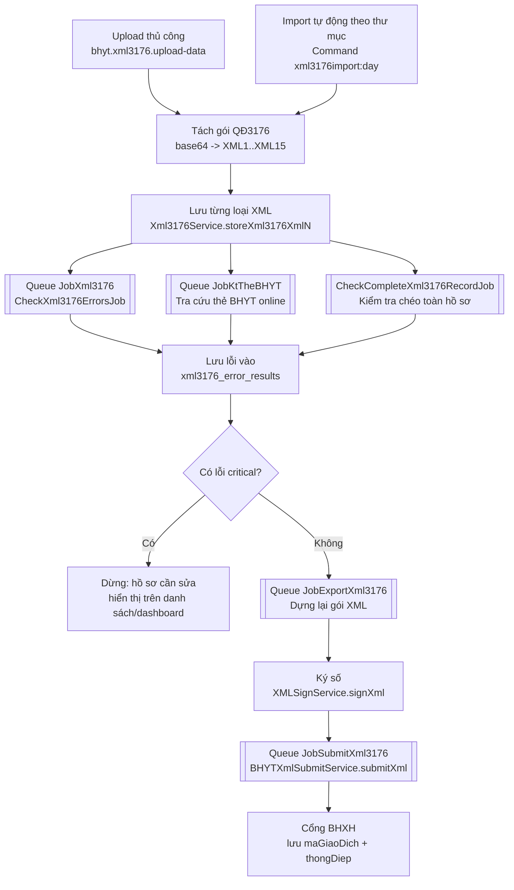
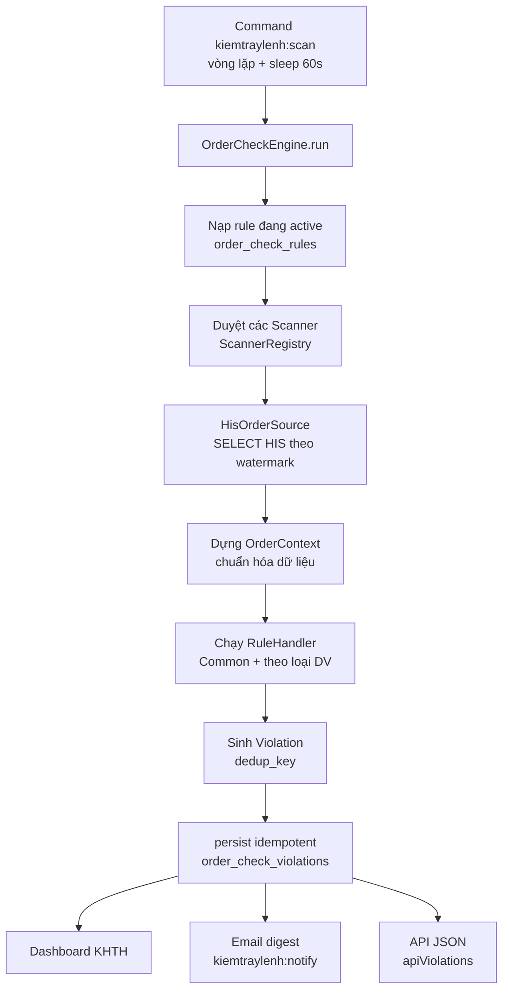

# Quy trình nghiệp vụ: Tiền giám định XML3176 & Kiểm tra sai sót y lệnh (Order-Check)

> Tài liệu mô tả quy trình cho hai module giám sát/tiền kiểm của hệ thống QLBV.
> Cập nhật: 2026-07-23. Phạm vi: mô tả luồng nghiệp vụ, thành phần, cấu hình và vận hành.
> Ghi chú kỹ thuật chi tiết (mã lỗi, bảng DB, spec/plan) xem trong `docs/superpowers/`.

---

## Mục lục

1. [Module 1 — Tiền giám định XML3176 (QĐ 3176)](#module-1--tiền-giám-định-xml3176-qđ-3176)
2. [Module 2 — Kiểm tra sai sót y lệnh (Order-Check)](#module-2--kiểm-tra-sai-sót-y-lệnh-order-check)
3. [So sánh & điểm chung hai module](#so-sánh--điểm-chung-hai-module)
4. [Checklist vận hành](#checklist-vận-hành)

---

## Module 1 — Tiền giám định XML3176 (QĐ 3176)

### 1.1. Mục tiêu

Tiền giám định hồ sơ BHYT theo **Quyết định 3176** (bộ chuẩn XML1–XML15) **trước khi gửi cổng BHXH**. Hệ thống tự động: nhận hồ sơ XML → tách/lưu từng loại XML → chạy bộ luật phát hiện lỗi → tra cứu thẻ BHYT online → chỉ hồ sơ **không có lỗi nghiêm trọng** mới được xuất XML, ký số và gửi cổng.

Quyền truy cập: middleware `checkrole:xml-man`. Người dùng thường chỉ thấy hồ sơ do **chính mình import** (`imported_by = loginname`); super/administrator thấy tất cả.

### 1.2. Sơ đồ luồng tổng thể

### 1.3. Quy trình từng bước

**Bước 1 — Nạp hồ sơ (2 đường vào)**
- **Upload thủ công**: người dùng tải file `.xml` qua màn hình import → `BHYTXml3176Controller@uploadData` → `processXmlData()`.
- **Import tự động**: Command `xml3176import:day` (`app/Console/Commands/XML3176Import.php`) chạy nền vòng lặp vô hạn, quét thư mục `D:\XML\3176TT` và `D:\XML\3176`. Xử lý xong sẽ **xóa file gốc**.

**Bước 2 — Tách và lưu dữ liệu**
- Đọc `THONGTINDONVI->MACSKCB`; duyệt từng `FILEHOSO`, mỗi `NOIDUNGFILE` là base64 → giải mã thành XML con.
- `switch(LOAIHOSO)` XML1..XML15 → gọi `Xml3176Service->storeXml3176XmlN()`.
- Khi gặp **XML1** (bản ghi gốc): kiểm tra cấu trúc theo `XmlStructures::$expectedStructures3176`, và gọi `deleteExistingXml3176($ma_lk)` để **xóa XML2–XML15 cũ** (giữ lại XML1/XML12) trước khi lưu lại.
- Khóa liên kết xuyên suốt là **`ma_lk`** (mã liên kết hồ sơ).

**Bước 3 — Kích hoạt kiểm tra lỗi (bất đồng bộ)**
Sau khi lưu, mỗi loại XML tự dồn việc lên queue:
- `CheckXml3176ErrorsJob` (queue `JobXml3176`): map loại XML → checker riêng `Xml3176Xml{N}Checker`. *(XML6, XML12, XML15 không có checker riêng.)*
- Với **XML1**: dispatch thêm việc **tra cứu thẻ BHYT online** (queue `JobKtTheBHYT`); kết quả lưu vào bảng `check_hein_card`.
- Sau khi xử lý hết các file của một hồ sơ: `CheckCompleteXml3176RecordJob` → `Xml3176CompleteChecker` **kiểm tra chéo** XML1 ↔ XML2/XML3 (khớp tiền thuốc/VTYT/tổng chi/BNTT/BHTT…, số ngày giường nội trú, thừa công khám, thiếu XML7 giấy ra viện).

**Bước 4 — Lưu lỗi & xác định mức độ**
- Mỗi checker gom danh sách lỗi (`error_code`, `error_name`, `critical_error`, `description`) rồi gọi `Xml3176ErrorService->saveErrors()`:
  - Bỏ qua nếu danh mục đánh dấu `is_check = false`.
  - Ghi vào `xml3176_error_results`.
  - Tự cập nhật danh mục `xml3176_error_catalogs` (upsert theo `xml + error_code`).
- **Tính "lỗi nghiêm trọng" (`critical_error`) do danh mục quyết định** — admin bật/tắt qua màn hình *Danh mục mã lỗi 3176*. Đây là "van" điều khiển hồ sơ nào bị chặn xuất XML.

**Bước 5 — Xuất XML → Ký số → Gửi cổng**
- Nếu bật `xml3176.export_xml3176_enabled`: `ExportXml3176Job` (queue `JobExportXml3176`) **chỉ xuất khi hồ sơ không có lỗi critical** (và `ngay_ra` không ở tương lai).
- `processExportXml()` dựng lại gói `<GIAMDINHHS>` → **ký số** bằng `XMLSignService->signXml()` (USB token/HSM) → lưu vào `D:\XML\ExportXml3176` → copy sang Trục dữ liệu Y tế.
- `SubmitXml3176Job` (queue `JobSubmitXml3176`): chỉ chạy nếu bật `organization.BHYT.submit_xml_3176_enabled` (**mặc định TẮT**). Gọi cổng BHXH, lưu `maGiaoDich` + `thongDiep` vào `xml3176_informations`.

**Bước 6 — Theo dõi & tra soát**
- Màn hình danh sách `bhyt.xml3176.index` (DataTables, nhiều bộ lọc theo mã LK/BN, khoảng ngày, trạng thái lỗi/export/submit/sign…).
- Màn hình chi tiết theo từng loại XML (`detail-xml-1..15`), chi tiết lỗi, chi tiết tra thẻ.
- **Dashboard chuyên biệt** `dashboard/xml3176`: 4 API — *overview* (5 KPI + phễu 5 bậc: Đã import → Không lỗi nghiêm trọng → Đã xuất → Đã ký → Đã gửi), *top-errors* (Pareto top 15), *aging* (tồn đọng theo tuổi hồ sơ 0-7/8-15/16-30/30+ ngày), *by-department* (hồ sơ lỗi nghiêm trọng theo khoa).
- Xuất Excel/XML lỗi để gửi các khoa xử lý.

### 1.4. Thành phần code chính

| Vai trò | File |
|---|---|
| Controller nghiệp vụ | `app/Http/Controllers/BHYT/BHYTXml3176Controller.php` |
| Controller dashboard | `app/Http/Controllers/Dashboard/Xml3176DashboardController.php` |
| Danh mục mã lỗi | `app/Http/Controllers/Category/CategoryBHYTController.php` |
| Service chính (lưu/xóa/xuất/gửi) | `app/Services/Xml3176Service.php` |
| Kiểm tra chéo toàn hồ sơ | `app/Services/Xml3176CompleteChecker.php` |
| Lưu lỗi + trạng thái critical | `app/Services/Xml3176ErrorService.php` |
| Checker từng XML | `app/Services/Xml3176Xml{1..14}Checker.php` |
| Ký số / Gửi cổng / Token BHXH | `app/Services/XMLSignService.php`, `BHYTXmlSubmitService.php`, `BHYTLoginService.php` |
| Jobs | `app/Jobs/{CheckXml3176ErrorsJob, CheckCompleteXml3176RecordJob, ExportXml3176Job, SubmitXml3176Job}.php` |
| Command import nền | `app/Console/Commands/XML3176Import.php` |
| Config | `config/xml3176.php`, `config/organization.php`, `config/filesystems.php` |

### 1.5. Dữ liệu & tích hợp ngoài

- **Bảng DB**: `xml3176_xml1s … xml3176_xml15s` (dữ liệu 15 loại XML, khóa `ma_lk`), `xml3176_informations` (trạng thái vòng đời: import/export/sign/submit), `xml3176_error_results` (kết quả lỗi), `xml3176_error_catalogs` (danh mục mã lỗi + cờ `is_check`/`critical_error`).
- **API BHXH**: lấy token (`api/token/take`), gửi hồ sơ (`api/qd130/guiHoSoXmlQD3176`), tra cứu lịch sử KCB/thẻ.
- **Cache token**: `BHYTLoginService` lưu token vào cache key `bhyt_tokens`, tự đăng nhập lại khi hết hạn.
- **Disk**: `D:\XML\3176`, `3176TT`, `ExportXml3176`, `TrucDuLieuYTe`…
- **Queue**: `JobXml3176`, `JobExportXml3176`, `JobSubmitXml3176`, `JobKtTheBHYT` — cần worker chạy đủ các queue này.

### 1.6. Công tắc cấu hình quan trọng

| Cấu hình | Ý nghĩa | Mặc định |
|---|---|---|
| `organization.xml_3176_not_check` | Tắt kiểm tra chéo toàn hồ sơ | false (bật kiểm tra) |
| `xml3176.export_xml3176_enabled` | Bật auto-export XML | true |
| `organization.export_xml_not_check` | Cho xuất kể cả có lỗi | false |
| `organization.BHYT.submit_xml_3176_enabled` | Bật gửi cổng BHXH | **false (đang tắt)** |

---

## Module 2 — Kiểm tra sai sót y lệnh (Order-Check)

### 2.1. Mục tiêu

Tự động phát hiện **sai sót trong y lệnh của bác sĩ** phát sinh trên HIS (Oracle `hispro_bvnn`). Nguyên tắc: **chỉ SELECT trên HIS, không gọi API, không đặt trigger, không sửa schema HIS**. Engine quét *incremental* theo watermark, chạy bộ quy tắc, lưu vi phạm vào MySQL (`qlbv`), rồi đưa lên dashboard / email / API.

Quyền truy cập: middleware `checkrole:administrator`.

### 2.2. Sơ đồ luồng tổng thể

### 2.3. Quy trình từng bước

**Bước 1 — Kích hoạt quét**
- Command `kiemtraylenh:scan` (`app/Console/Commands/HISProKiemTraYLenh.php`) chạy nền như nssm service: `runOnce()` + `sleep(60s)`. Có cờ `--once`, `--limit=N`.

**Bước 2 — Engine điều phối** (`app/Services/OrderCheck/OrderCheckEngine.php`)
1. Nạp toàn bộ `order_check_rules` đang `is_active`, cache theo `code`.
2. Duyệt từng scanner trong `ScannerRegistry`; mỗi lần quét ghi một bản ghi `order_check_rule_logs` (`running` → `success`/`error` + số quét/số vi phạm).
3. `persist()`: ghi **idempotent** theo `dedup_key`; vi phạm đã `processed`/`false_positive` sẽ **không bị hồi sinh**.
4. Cập nhật **watermark** (theo id / create_time / modify_time) để lần sau chỉ quét dữ liệu mới.

**Bước 3 — Đọc dữ liệu HIS** (`HisOrderSource.php`, connection `HISPro`)
- Quét `HIS_SERVICE_REQ` theo `MODIFY_TIME` (dùng index hint), sau đó *batched lookup* các bảng con `WHERE id IN (...)` để tránh JOIN bảng lớn.
- Dựng `OrderContext` chuẩn hóa. Lưu ý phân biệt vai trò:
  - `doctor = request_loginname` → **người chỉ định** y lệnh.
  - `execute_loginname/diploma` → **người thực hiện** dịch vụ.
  - `departmentId = execute_department_id` → **khoa thực hiện**.

**Bước 4 — Áp dụng quy tắc**
- Có **4 scanner** ứng với 4 nguồn dữ liệu HIS (xem §2.5).
- `ServiceReqScanner` với mỗi phiếu chạy: `CommonRules` (5 luật áp mọi loại phiếu) + luật riêng theo loại dịch vụ (`ServiceReqRuleRegistry::forType`). Chỉ chạy handler nếu rule tương ứng đang active.

**Bước 5 — Lưu vi phạm & workflow xử lý**
- Vi phạm ghi vào `order_check_violations` với `dedup_key` chống trùng, trạng thái vòng đời: `new → seen → processed / false_positive`.
- Người dùng KHTH xử lý trên dashboard: đánh dấu *đã xử lý / bỏ qua (dương tính giả)* + ghi chú (`OrderCheckController@updateStatus`).

**Bước 6 — Đầu ra**
- **Dashboard** `khth/order-check-index`: lọc theo ngày/khoa/mức độ/loại luật/trạng thái + KPI + DataTables; xuất Excel.
- **Email digest** (`kiemtraylenh:notify`): gửi vi phạm mới theo ngưỡng severity tới danh sách `email_receive_report`. **Mặc định TẮT.**
- **API JSON** `apiViolations`: tra cứu vi phạm theo đợt điều trị.
- Hai màn quản trị kèm theo: *Danh mục giới hạn dịch vụ* (`order-check-ref-index`) và *Quản lý quy tắc* (`order-check-rule-index`, bật/tắt & sửa mức độ trên UI).

### 2.4. Ý nghĩa các "giai đoạn 1..7"

"Giai đoạn" là **các mốc phát triển (release)**, không phải bước trong luồng chạy:

| Giai đoạn | Nội dung chính |
|---|---|
| **GĐ 1** | Nền tảng + Họ luật B: quét incremental theo watermark; 4 luật cấu trúc/thời gian/hành nghề. |
| **GĐ 2** | Engine đa-nguồn (multi-scanner) + Họ A lâm sàng (tương tác thuốc A1, thiếu chẩn đoán ICD A4). |
| **GĐ 3** | Dashboard KHTH + workflow xử lý + export Excel + API JSON. |
| **GĐ 4** | Email digest định kỳ (`kiemtraylenh:notify`) — mặc định tắt. |
| **GĐ 5** | Luật cấp đợt điều trị. *(A2 trùng hoạt chất, A3 trùng DV sau đó đã gỡ; chỉ còn A5 sai lệch liều × ngày ≠ số lượng.)* |
| **GĐ 6** | Danh mục giới hạn dịch vụ theo giới tính/tuổi + 2 luật `A_GENDER_MISMATCH`, `A_AGE_OUT_OF_RANGE`. |
| **GĐ 7** | Trang Quản lý quy tắc (bật/tắt, sửa mức độ trên UI) + tách khung luật theo 18 loại dịch vụ; sửa để `route:cache` chạy được. |

> Phân biệt 3 khái niệm dễ nhầm: **giai đoạn** (mốc release) ≠ **họ luật A/B** ≠ **18 nhóm luật theo loại dịch vụ** (khung `Types/*Rules.php`, hiện đa số còn rỗng để mở rộng dần).

### 2.5. Scanner & danh mục quy tắc

**4 Scanner** (`ScannerRegistry`):

| Scanner | Nguồn HIS | Luật áp dụng |
|---|---|---|
| `ServiceReqScanner` | HIS_SERVICE_REQ | 5 luật Common + luật theo loại DV |
| `InteractionLogScanner` | HIS_MEDICINE_INTERACTIVE | `A_DRUG_INTERACTION` |
| `MedicineScanner` | HIS_EXP_MEST_MEDICINE | `A_DOSE_MISMATCH` (A5) |
| `ServiceRestrictionScanner` | HIS_SERE_SERV + HIS_TREATMENT | `A_GENDER_MISMATCH`, `A_AGE_OUT_OF_RANGE` |

**Danh mục quy tắc** (seed `2026_06_30_100005_seed_order_check_rules.php`):

| Code | Họ | Ý nghĩa | Mức độ |
|---|---|---|---|
| `B_DISCHARGE_BEFORE_ADMISSION` | B | Giờ ra viện < giờ vào viện | critical |
| `B_ORDER_TIME_OUT_OF_STAY` | B | Giờ y lệnh trước lúc vào / sau lúc ra | warning |
| `B_EXECUTE_BEFORE_ORDER` | B | Giờ thực hiện DV < giờ ra y lệnh | warning |
| `B_DOCTOR_NO_PRACTICE_CERT` | B | Người thực hiện thiếu CCHN (`DIPLOMA` trống) | critical |
| `A_DRUG_INTERACTION` | A | Tương tác thuốc HIS đã ghi nhận | warning |
| `A_MISSING_DIAGNOSIS` | A | Phiếu thiếu ICD (loại trừ loại phiếu theo config) | warning |
| `A_DOSE_MISMATCH` | A | (sáng+trưa+chiều+tối) × số ngày ≠ số lượng cấp | info |
| `A_GENDER_MISMATCH` | A | Giới tính BN ≠ giới tính DV yêu cầu | warning |
| `A_AGE_OUT_OF_RANGE` | A | Tuổi BN ngoài khoảng cho phép của DV | warning |

> Quy ước: `B_*` = họ cấu trúc/thời gian/hành nghề (logic hardcode); `A_*` = họ lâm sàng (data-driven). Admin bật/tắt/đổi mức độ qua UI *Quản lý quy tắc*.

### 2.6. Dữ liệu & thành phần chính

- **Engine/Source**: `app/Services/OrderCheck/{OrderCheckEngine, HisOrderSource}.php`.
- **Scanner**: `app/Services/OrderCheck/Scanners/*`.
- **Rule handler**: `app/Services/OrderCheck/RuleHandlers/{Structural, Clinical, ServiceReq}/*`.
- **Controller**: `OrderCheckController`, `OrderCheckRefController`, `OrderCheckRuleController`.
- **Bảng MySQL (`qlbv`)**: `order_check_watermarks`, `order_check_rules`, `order_check_violations`, `order_check_rule_logs`, `order_check_ref_service_restriction`.
- **Bảng HIS đọc (chỉ SELECT)**: `HIS_SERVICE_REQ`, `HIS_SERE_SERV`, `HIS_MEDICINE_INTERACTIVE`, `HIS_EXP_MEST_MEDICINE`, `HIS_TREATMENT`, `HIS_EMPLOYEE`, `HIS_DEPARTMENT`, `HIS_SERVICE_REQ_TYPE`.
- **Config** `config/order_check.php`: `his_connection=HISPro`, `batch_size=500`, `ORDER_CHECK_SCAN_SLEEP=60`, `ORDER_CHECK_NOTIFY_ENABLED=false`…

### 2.7. Lưu ý vận hành

- **Hiệu năng là ưu tiên số 1**: bảng HIS hàng triệu dòng → bắt buộc quét theo cột có index, tránh JOIN bảng lớn có watermark (đã từng gây 121–127s/lần quét). Xem `docs/order-check/HUONG-DAN-THEM-QUY-TAC.md §8`.
- **Idempotent** qua watermark + `dedup_key`; vi phạm đã xử lý không bị tạo lại.
- Luật CCHN áp cho **người thực hiện**, dùng cột `DIPLOMA` (không dùng `PRACTICE_SCOPE_DECISION` vì trống 100%).
- 18 file `Types/*Rules.php` hiện phần lớn còn rỗng — là khung mở rộng theo từng loại dịch vụ.
- Triển khai qua `update.bat` (git pull + migrate + restart service `QLBV KiemTraYLenh`/`Notify`).

---

## So sánh & điểm chung hai module

| Tiêu chí | XML3176 | Order-Check |
|---|---|---|
| Mục đích | Tiền giám định hồ sơ BHYT trước khi gửi cổng BHXH | Phát hiện sai sót y lệnh nội bộ trên HIS |
| Nguồn dữ liệu | File XML QĐ3176 (import/upload) | Đọc trực tiếp HIS (Oracle), chỉ SELECT |
| Kích hoạt | Queue Job (theo sự kiện import) + command import nền | Command quét nền theo watermark (60s/lần) |
| Đơn vị xử lý | Hồ sơ theo `ma_lk` | Phiếu y lệnh / dịch vụ con |
| Kết quả | `xml3176_error_results` + xuất/ký/gửi cổng | `order_check_violations` + dashboard/email/API |
| Phân quyền | `checkrole:xml-man` | `checkrole:administrator` |
| Danh mục điều khiển | `xml3176_error_catalogs` (is_check/critical) | `order_check_rules` (is_active/severity) |
| Chống trùng | `ma_lk` + xóa/ghi lại | `dedup_key` idempotent |
| Đầu ra "cổng" | Có (gửi BHXH — mặc định tắt) | Không (chỉ nội bộ) |

**Điểm chung về kiến trúc:**
- Cả hai đều **bất đồng bộ / chạy nền** (queue worker hoặc console service), tách khỏi request người dùng.
- Cả hai đều có **danh mục quy tắc bật/tắt được từ UI**, cho phép người quản trị tinh chỉnh mà không sửa code.
- Cả hai đều **lưu vết** (error results / violations + logs) và có **dashboard** theo dõi.
- Cả hai đều có nhiều **công tắc cấu hình mặc định TẮT** cho các hành động ra bên ngoài (gửi cổng BHXH / gửi email) — bật thủ công khi sẵn sàng.

---

## Checklist vận hành

**XML3176**
- [ ] Worker đang chạy đủ các queue: `JobXml3176`, `JobExportXml3176`, `JobSubmitXml3176`, `JobKtTheBHYT`.
- [ ] Command import nền `xml3176import:day` đang chạy (nếu dùng import tự động theo thư mục).
- [ ] Kiểm tra `dashboard/xml3176` → phễu và mục *aging* để phát hiện tồn đọng.
- [ ] Trước khi bật gửi cổng: xác nhận `organization.BHYT.submit_xml_3176_enabled` và cấu hình token BHXH.

**Order-Check**
- [ ] Service `kiemtraylenh:scan` đang chạy; xem `order_check_rule_logs` để chắc mỗi scanner `success`.
- [ ] Theo dõi thời gian mỗi lần quét (cảnh giác nếu > vài chục giây → xem lại index/query).
- [ ] Xem lại các luật đang `is_active` và mức độ trên màn *Quản lý quy tắc*.
- [ ] Nếu muốn nhận email: bật `ORDER_CHECK_NOTIFY_ENABLED` + kiểm tra danh sách `email_receive_report`.

---

*Tài liệu tổng hợp từ khảo sát mã nguồn ngày 2026-07-23. Chi tiết mã lỗi, cấu trúc bảng và các bản thiết kế xem trong `docs/superpowers/specs/`, `docs/superpowers/plans/`, `docs/order-check/`.*
