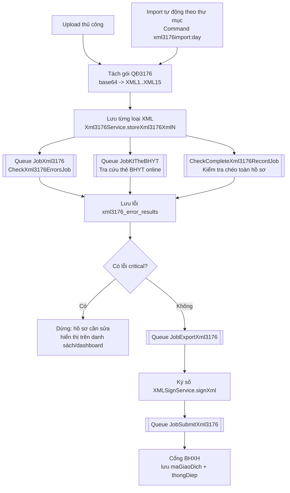
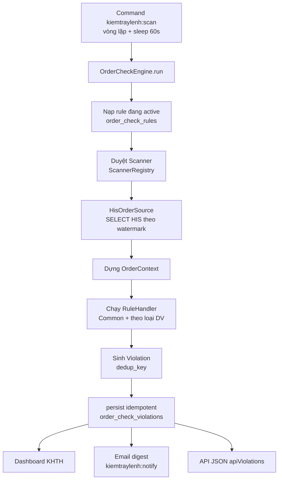
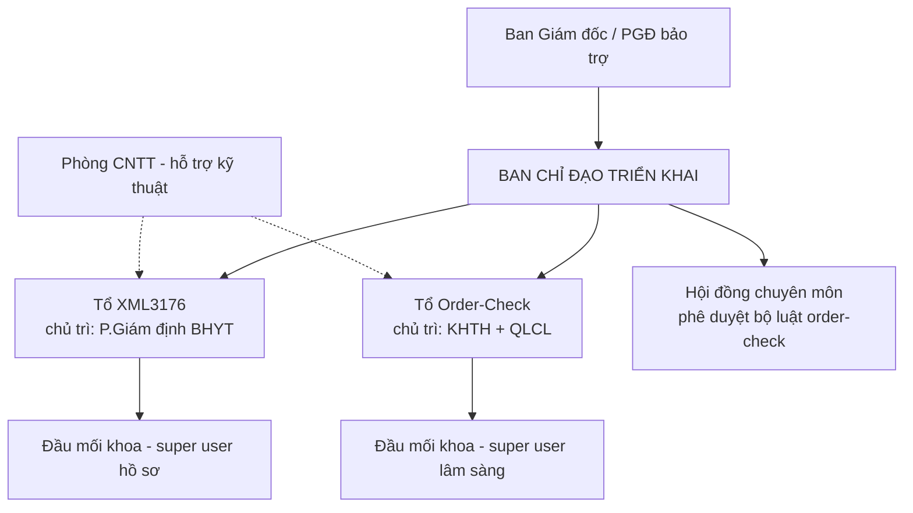

# Tài liệu tổng hợp — Hệ thống XML3176 & Order-Check

> Tài liệu hợp nhất, bao gồm: mô tả kỹ thuật quy trình, chuẩn bị triển khai,
> quy trình quản lý con người (triển khai tại bệnh viện), và hướng dẫn lập trình
> thêm quy tắc mới. Dùng cho cả người quản lý lẫn lập trình viên/maintainer.
>
> Mọi `file:line` trích từ mã nguồn thực tế; khi code thay đổi cần đối chiếu lại.
> Cập nhật: 2026-07-23.

---

## Mục lục

**Phần I — Tổng quan & mô tả kỹ thuật**
- [1. Giới thiệu hai module](#1-giới-thiệu-hai-module)
- [2. Module XML3176 — Tiền giám định BHYT](#2-module-xml3176--tiền-giám-định-bhyt)
- [3. Module Order-Check — Kiểm tra sai sót y lệnh](#3-module-order-check--kiểm-tra-sai-sót-y-lệnh)
- [4. So sánh & điểm chung](#4-so-sánh--điểm-chung-hai-module)

**Phần II — Chuẩn bị triển khai**
- [5. Tóm tắt chuẩn bị (Quy trình · Hạ tầng · Con người)](#5-tóm-tắt-chuẩn-bị)

**Phần III — Quy trình quản lý con người**
- [6. Nguyên tắc & chính sách No-blame](#6-nguyên-tắc--chính-sách-no-blame)
- [7. Bộ máy quản trị & các bên liên quan](#7-bộ-máy-quản-trị--các-bên-liên-quan)
- [8. Quản trị "quyền sở hữu quy tắc"](#8-quản-trị-quyền-sở-hữu-quy-tắc)
- [9. SOP & ma trận trách nhiệm](#9-sop--ma-trận-trách-nhiệm)
- [10. Lộ trình, đào tạo, KPI, rủi ro](#10-lộ-trình-đào-tạo-kpi-rủi-ro)

**Phần IV — Hướng dẫn lập trình thêm quy tắc**
- [11. Mô hình chung khi thêm quy tắc](#11-mô-hình-chung-khi-thêm-quy-tắc)
- [12. Thêm quy tắc cho XML3176](#12-thêm-quy-tắc-cho-xml3176)
- [13. Thêm quy tắc cho Order-Check](#13-thêm-quy-tắc-cho-order-check)
- [14. Checklist chung & quy tắc vàng](#14-checklist-chung--quy-tắc-vàng)

---
---

# PHẦN I — TỔNG QUAN & MÔ TẢ KỸ THUẬT

## 1. Giới thiệu hai module

| | **XML3176** | **Order-Check** |
|---|---|---|
| Mục đích | Tiền giám định hồ sơ BHYT trước khi gửi cổng BHXH | Phát hiện sai sót y lệnh nội bộ trên HIS |
| Nguồn dữ liệu | File XML QĐ3176 (import/upload) | Đọc trực tiếp HIS Oracle (chỉ SELECT) |
| Kích hoạt | Queue Job theo sự kiện import + command import nền | Command quét nền theo watermark (60s/lần) |
| Kết quả | `xml3176_error_results` + xuất/ký/gửi cổng | `order_check_violations` + dashboard/email/API |
| Phân quyền | `checkrole:xml-man` | `checkrole:order-check` |
| Độ nhạy cảm con người | Trung bình (tài chính) | **Rất cao** (bắt lỗi bác sĩ) |

> **Menu và quyền của Order-Check** (từ 29/07/2026): mục `Kiểm tra sai sót y lệnh` là
> mục **cấp 1**, đặt ngay **trên** `Hồ sơ XML` — trước đây nằm trong `Kế hoạch tổng hợp`.
> Quyền là role riêng `order-check`, không còn dùng `administrator`.
>
> Khi triển khai **bắt buộc chạy `php artisan migrate`** để tạo role. Không chạy thì
> **không ai vào được**, kể cả superadmin: `AppServiceProvider::filterMenu` cho
> superadministrator xem toàn bộ menu không lọc, nhưng middleware `CheckRole` **không có**
> ngoại lệ cho superadministrator — kết quả là thấy menu nhưng bấm vào bị 403.
>
> Sau khi migrate, còn phải chạy thêm hai lệnh:
> - `php artisan config:clear` — menu nằm trong `config/adminlte.php`; nếu máy chủ đang
>   cache config thì menu hiển thị vẫn là bản cũ dù đã deploy code mới.
> - `php artisan cache:clear` — Laratrust cache kết quả `hasRole()` 60 phút một lần
>   (`Cache::remember(..., 60, ...)`). Migration đã tự `Cache::forget()` cho từng người
>   được gán role, nhưng bước này vẫn nên có trong quy trình chuẩn để phòng trường hợp
>   migrate bằng đường khác (ví dụ chạy tay trên console, không qua script deploy).
>
> **Cảnh báo trước khi chạy trên máy chủ thật:** migration gán role `order-check` cho
> **mọi** người đang có role `xml-man`. Phải kiểm tra danh sách đó có đúng ý không trước,
> bằng câu lệnh:
> ```sql
> SELECT user_id FROM role_user WHERE role_id = (SELECT id FROM roles WHERE name = 'xml-man');
> ```
> Order-check là module **rất nhạy cảm** (bắt lỗi bác sĩ), mở quyền nhầm cho người không
> nên có là chuyện lớn.

Cả hai đều **bất đồng bộ / chạy nền**, có **danh mục quy tắc bật/tắt từ UI**, có **lưu vết + dashboard**, và có nhiều **công tắc cấu hình mặc định TẮT** cho hành động ra bên ngoài (gửi cổng BHXH / gửi email).

---

## 2. Module XML3176 — Tiền giám định BHYT

### 2.1. Mục tiêu
Tiền giám định hồ sơ BHYT theo **Quyết định 3176** (bộ chuẩn XML1–XML15) *trước khi* gửi cổng BHXH. Chỉ hồ sơ **không có lỗi nghiêm trọng (critical)** mới được xuất XML, ký số và gửi. Người dùng thường chỉ thấy hồ sơ do chính mình import; super/administrator thấy tất cả.

### 2.2. Sơ đồ luồng



### 2.3. Quy trình từng bước

1. **Nạp hồ sơ:** (a) upload thủ công `.xml` → `BHYTXml3176Controller@uploadData`; hoặc (b) import tự động qua Command `xml3176import:day` quét thư mục `D:\XML\3176TT`, `D:\XML\3176` (xử lý xong xóa file gốc).
2. **Tách & lưu:** mỗi `FILEHOSO` là base64 → XML con; `switch(LOAIHOSO)` XML1..15 → `Xml3176Service->storeXml3176XmlN()`. Khi gặp XML1: xóa XML2–15 cũ (giữ XML1/XML12) rồi lưu lại. Khóa xuyên suốt là **`ma_lk`**.
3. **Kích hoạt kiểm tra (bất đồng bộ):** `CheckXml3176ErrorsJob` → checker từng loại; XML1 còn tra thẻ BHYT online (queue `JobKtTheBHYT`); hết file → `CheckCompleteXml3176RecordJob` → `Xml3176CompleteChecker` kiểm tra chéo XML1↔XML2/XML3 (khớp tiền, số ngày giường, thiếu XML7…).
4. **Lưu lỗi & mức độ:** checker gom lỗi → `Xml3176ErrorService->saveErrors()`: bỏ qua nếu catalog `is_check=false`, ghi `xml3176_error_results`, upsert `xml3176_error_catalogs`. **`critical_error` do danh mục quyết định** (admin chỉnh) — là "van" chặn xuất XML.
5. **Xuất → Ký → Gửi:** nếu bật `export_xml3176_enabled`, `ExportXml3176Job` chỉ xuất khi không có lỗi critical → ký số (USB token/HSM) → lưu `D:\XML\ExportXml3176` → copy Trục dữ liệu Y tế → `SubmitXml3176Job` gọi cổng BHXH (chỉ khi `submit_xml_3176_enabled`, **mặc định TẮT**).
6. **Theo dõi:** danh sách `bhyt.xml3176.index`, chi tiết từng XML, **dashboard** `dashboard/xml3176` (overview + phễu 5 bậc, top-errors Pareto, aging tồn đọng, by-department).

### 2.4. Thành phần & dữ liệu chính

| Vai trò | File |
|---|---|
| Controller nghiệp vụ / dashboard | `app/Http/Controllers/BHYT/BHYTXml3176Controller.php`, `Dashboard/Xml3176DashboardController.php` |
| Service chính | `app/Services/Xml3176Service.php` |
| Kiểm tra chéo / lưu lỗi | `app/Services/Xml3176CompleteChecker.php`, `Xml3176ErrorService.php` |
| Checker từng XML | `app/Services/Xml3176Xml{1,2,3,4,5,7,8,9,10,11,13,14}Checker.php` (XML6/12/15 không có checker riêng) |
| Ký số / gửi cổng / token | `app/Services/{XMLSignService, BHYTXmlSubmitService, BHYTLoginService}.php` |
| Jobs | `app/Jobs/{CheckXml3176ErrorsJob, CheckCompleteXml3176RecordJob, ExportXml3176Job, SubmitXml3176Job}.php` |
| Command import nền | `app/Console/Commands/XML3176Import.php` |
| Config | `config/xml3176.php`, `config/organization.php`, `config/filesystems.php` |

**Bảng DB:** `xml3176_xml1s..xml3176_xml15s` (khóa `ma_lk`), `xml3176_informations` (trạng thái import/export/sign/submit), `xml3176_error_results` (kết quả lỗi), `xml3176_error_catalogs` (danh mục + cờ `is_check`/`critical_error`).
**Tích hợp ngoài:** API BHXH (token `api/token/take`, gửi `api/qd130/guiHoSoXmlQD3176`, tra thẻ/lịch sử KCB); token cache key `bhyt_tokens`; disk `D:\XML\...`; queue `JobXml3176`, `JobExportXml3176`, `JobSubmitXml3176`, `JobKtTheBHYT`.

### 2.5. Công tắc cấu hình quan trọng

| Cấu hình | Ý nghĩa | Mặc định |
|---|---|---|
| `organization.xml_3176_not_check` | Tắt kiểm tra chéo | false (bật) |
| `xml3176.export_xml3176_enabled` | Bật auto-export | true |
| `organization.export_xml_not_check` | Cho xuất kể cả có lỗi | false |
| `organization.BHYT.submit_xml_3176_enabled` | Bật gửi cổng BHXH | **false (tắt)** |

---

## 3. Module Order-Check — Kiểm tra sai sót y lệnh

### 3.1. Mục tiêu
Tự động phát hiện **sai sót y lệnh của bác sĩ** trên HIS (Oracle `hispro_bvnn`). Nguyên tắc: **chỉ SELECT HIS, không API, không trigger, không sửa schema HIS**. Engine quét *incremental* theo watermark, chạy bộ quy tắc, lưu vi phạm vào MySQL `qlbv`, đưa lên dashboard/email/API.

### 3.2. Sơ đồ luồng



### 3.3. Quy trình & thành phần
- **Điểm vào:** command `kiemtraylenh:scan` (quét, sleep 60s) và `kiemtraylenh:notify` (email digest, mặc định TẮT), chạy dưới dạng nssm service.
- **Engine** (`OrderCheckEngine.php`): nạp rule active → duyệt scanner → mỗi scanner ghi log `order_check_rule_logs` → `persist()` idempotent theo `dedup_key` (không hồi sinh vi phạm đã `processed`/`false_positive`) → cập nhật watermark.
- **4 Scanner** (`ScannerRegistry`): `ServiceReqScanner` (HIS_SERVICE_REQ, luật Common + theo loại DV), `InteractionLogScanner` (tương tác thuốc), `MedicineScanner` (sai liều A5), `ServiceRestrictionScanner` (giới tính/tuổi).
- **Đầu ra:** dashboard `khth/order-check-index`, workflow trạng thái `new→seen→processed/false_positive`, export Excel, email digest, API JSON, 2 màn quản trị (danh mục giới hạn DV, quản lý quy tắc).

### 3.4. Danh mục quy tắc (seed)

| Code | Họ | Ý nghĩa | Mức độ |
|---|---|---|---|
| `B_DISCHARGE_BEFORE_ADMISSION` | B | Giờ ra viện < giờ vào viện | critical |
| `B_ORDER_TIME_OUT_OF_STAY` | B | Giờ y lệnh trước lúc vào / sau lúc ra | warning |
| `B_EXECUTE_BEFORE_ORDER` | B | Giờ thực hiện < giờ ra y lệnh | warning |
| `B_DOCTOR_NO_PRACTICE_CERT` | B | Người thực hiện thiếu CCHN (`DIPLOMA` trống) | critical |
| `A_DRUG_INTERACTION` | A | Tương tác thuốc HIS đã ghi nhận | warning |
| `A_MISSING_DIAGNOSIS` | A | Phiếu thiếu ICD | warning |
| `A_DOSE_MISMATCH` | A | (sáng+trưa+chiều+tối)×số ngày ≠ số lượng cấp | info |
| `A_GENDER_MISMATCH` | A | Giới tính BN ≠ giới tính DV yêu cầu | warning |
| `A_AGE_OUT_OF_RANGE` | A | Tuổi BN ngoài khoảng cho phép | warning |

> `B_*` = họ cấu trúc/thời gian/hành nghề (logic hardcode); `A_*` = họ lâm sàng (data-driven).

### 3.5. "Giai đoạn 1..7" là gì
Là **các mốc phát triển (release)**, không phải bước trong luồng chạy: GĐ1 nền tảng + họ B; GĐ2 engine đa-nguồn + họ A; GĐ3 dashboard/workflow/Excel/API; GĐ4 email digest; GĐ5 luật cấp đợt điều trị (A2/A3 sau đã gỡ, còn A5); GĐ6 danh mục giới hạn DV (giới tính/tuổi); GĐ7 quản lý quy tắc trên UI + tách khung luật theo 18 loại DV.

### 3.6. Lưu ý kỹ thuật
- Bảng HIS hàng triệu dòng → bắt buộc quét theo cột có index, tránh JOIN bảng lớn (đã từng 121–127s/lần quét).
- Luật CCHN áp cho **người thực hiện** (`execute_diploma`), dùng cột `DIPLOMA`.
- 18 file `Types/*Rules.php` hiện phần lớn **còn rỗng** — là khung mở rộng.
- Config `config/order_check.php`: `his_connection=HISPro`, `batch_size=500`, `ORDER_CHECK_NOTIFY_ENABLED=false`…

---

## 4. So sánh & điểm chung hai module

| Tiêu chí | XML3176 | Order-Check |
|---|---|---|
| Đơn vị xử lý | Hồ sơ theo `ma_lk` | Phiếu y lệnh / DV con |
| Kích hoạt | Queue Job (sự kiện import) | Command quét nền (watermark) |
| Danh mục điều khiển | `xml3176_error_catalogs` (`is_check`/`critical`) | `order_check_rules` (`is_active`/`severity`) |
| Chống trùng | `ma_lk` + xóa/ghi lại | `dedup_key` idempotent |
| Đầu ra "cổng ngoài" | Có (gửi BHXH — mặc định tắt) | Không (nội bộ) |
| Rủi ro hiệu năng | Thấp | **Cao (quét HIS trực tiếp)** |

---
---

# PHẦN II — CHUẨN BỊ TRIỂN KHAI

## 5. Tóm tắt chuẩn bị

### 5.1. Về QUY TRÌNH
1. **Chốt quyền sở hữu quy tắc:** ai đề xuất – ai duyệt – ai bật/tắt danh mục mã lỗi XML3176 và bộ luật Order-Check.
2. **Ban hành SOP + SLA xử lý** cho từng module.
3. **Ban hành cam kết No-blame** cho order-check.
4. **Quy định chạy song song** với quy trình cũ trước khi thay thế.

### 5.2. Về HẠ TẦNG
1. **Kết nối:** quyền SELECT HIS Oracle (`HISPro`) + CSDL MySQL `qlbv`.
2. **Queue worker (XML3176):** đủ `JobXml3176`, `JobExportXml3176`, `JobSubmitXml3176`, `JobKtTheBHYT`.
3. **Console service (Order-Check):** `kiemtraylenh:scan`, `kiemtraylenh:notify` (nssm); command import XML3176 nền nếu dùng.
4. **Thư mục/disk:** các đường dẫn XML — khớp hạ tầng thực tế, không hard-code `D:\XML\...`.
5. **Ký số & cổng BHXH:** USB token/HSM, tài khoản + token BHXH, mã CSKCB; ban đầu để gửi cổng **TẮT**.
6. **Hiệu năng:** kiểm tra index trên bảng HIS lớn (`HIS_SERVICE_REQ`…).

### 5.3. Về CON NGƯỜI
1. **Lập bộ máy:** Ban chỉ đạo + Tổ XML3176 + Tổ Order-Check + Hội đồng chuyên môn.
2. **Cử đầu mối tại mỗi khoa** (super user).
3. **Đào tạo theo nhóm:** super user (sâu), bác sĩ/điều dưỡng (nhẹ, nhấn no-blame), giám định/KHTH (nghiệp vụ).
4. **Truyền thông chính thức** qua văn bản Ban Giám đốc + họp giao ban.

### 5.4. Trình tự gợi ý
```
Chuẩn bị quy trình + con người  ──►  Dựng hạ tầng (worker/service/kết nối)
        └──────────►  Pilot 1-2 khoa (chạy song song)  ◄──────────┘
                              ▼
                   Hiệu chỉnh ──► Nhân rộng ──► Vận hành thường quy
```

---
---

# PHẦN III — QUY TRÌNH QUẢN LÝ CON NGƯỜI

*(Xây dựng cho phương án triển khai song song cả hai module, với chính sách No-blame tuyệt đối cho order-check. Cần điều chỉnh theo cơ cấu tổ chức thực tế trước khi ban hành.)*

## 6. Nguyên tắc & chính sách No-blame

### 6.1. Năm nguyên tắc nền tảng
1. **Một Ban chỉ đạo, hai luồng công việc** (tránh phân tán khi triển khai song song).
2. **Con người sở hữu quy tắc, hệ thống chỉ thực thi.**
3. **Nghiệp vụ chủ trì, CNTT hỗ trợ** (nếu để CNTT chủ trì, khoa sẽ coi là "việc của IT").
4. **Chạy song song với quy trình cũ** trước khi thay thế.
5. **No-blame tuyệt đối cho order-check.**

### 6.2. Chính sách No-blame tuyệt đối (bắt buộc)
> Điều kiện sống còn để order-check được giới chuyên môn chấp nhận.

- Dữ liệu vi phạm **chỉ dùng để:** hiệu chỉnh bộ luật (giảm dương tính giả), phát hiện lỗ hổng quy trình hệ thống, cải tiến chất lượng ở cấp tổ chức.
- **Tuyệt đối không dùng để:** đánh giá thi đua, xếp loại, kỷ luật, cắt thưởng, hay chế tài cá nhân.
- Báo cáo lên cấp bệnh viện **ẩn danh/tổng hợp** (nói về loại lỗi & xu hướng, không nêu tên).
- **Vì sao "tuyệt đối":** nếu bác sĩ tin dữ liệu sẽ bị dùng để đánh giá, họ sẽ "lách" hoặc chống đối ngay từ đầu. Cam kết tuyệt đối tạo an toàn tâm lý để trung thực nhìn nhận sai sót.
- **Không có nghĩa buông lỏng:** vi phạm nghiêm trọng/lặp lại xử lý qua **kênh chuyên môn hiện hữu** (bình bệnh án, Hội đồng chuyên môn, quy chế), *không* qua số liệu order-check.

---

## 7. Bộ máy quản trị & các bên liên quan



| Thành phần | Thành viên đề xuất | Vai trò |
|---|---|---|
| Ban chỉ đạo | PGĐ bảo trợ + Trưởng KHTH + QLCL + P.Giám định + CNTT | Quyết chính sách, phê duyệt danh mục/luật, xử lý xung đột |
| Tổ XML3176 | P.Giám định (chủ trì) + giám định viên + CNTT | Vận hành, cấu hình danh mục, đôn đốc sửa hồ sơ |
| Tổ Order-Check | KHTH + QLCL + bác sĩ uy tín + CNTT | Sàng lọc dương tính giả, phản hồi khoa, đề xuất chỉnh luật |
| Hội đồng chuyên môn | Chuyên gia đầu ngành | Thẩm định & phê duyệt bộ luật lâm sàng |
| Đầu mối khoa | 1 super user/khoa | Nhận cảnh báo, điều phối xử lý nội bộ |

**Các bên liên quan chính:** Bác sĩ (nhạy cảm cao — no-blame + Hội đồng CM làm chủ luật); Trưởng khoa (đầu mối); P.Giám định (chủ trì XML3176); KHTH/QLCL (chủ trì order-check); CNTT (hỗ trợ, không chủ trì nghiệp vụ); Ban Giám đốc (sponsor).

---

## 8. Quản trị "quyền sở hữu quy tắc"

Điểm quản trị quan trọng nhất — vì cả hai hệ thống đều bật/tắt & chỉnh mức độ quy tắc từ giao diện.

| Đối tượng cấu hình | Ai đề xuất | Ai phê duyệt | Ai thao tác |
|---|---|---|---|
| Danh mục mã lỗi XML3176 (`is_check`, `critical_error`) | P.Giám định BHYT | Ban chỉ đạo | Tổ XML3176 (có nhật ký) |
| Bộ luật Order-Check (`is_active`, `severity`) | Tổ order-check | **Hội đồng chuyên môn** | Tổ order-check |
| Danh mục giới hạn DV (giới tính/tuổi) | Khoa chuyên môn | Tổ order-check | Tổ order-check |

**Bất di bất dịch:** không cá nhân nào tự ý bật/tắt ngoài quy trình; mọi thay đổi ghi lại (ai/khi nào/vì sao); **không bật luật lâm sàng khi Hội đồng chuyên môn chưa thẩm định**.

---

## 9. SOP & ma trận trách nhiệm

### 9.1. SOP — XML3176
```
Hệ thống báo lỗi critical (ma_lk)
 → P.Giám định phân loại (do khoa / mã hóa / dữ liệu)
   → Giao đầu mối khoa sửa (SLA vd 48h)
     → Giám định viên duyệt lại → Đạt: xuất/ký/gửi cổng | Chưa: trả lại khoa
```
Chốt: phân loại lỗi tại nguồn; SLA đưa vào quy chế; dùng biểu đồ *aging* đôn đốc; bật gửi cổng trực tiếp chỉ khi tỷ lệ lỗi ổn định.

### 9.2. SOP — Order-Check (khung no-blame)
```
Engine sinh vi phạm (status=new)
 → KHTH/QLCL sàng lọc: dương tính giả -> false_positive (+ghi chú chỉnh luật)
                        vi phạm thật  -> chuyển khoa qua đầu mối
 → Trưởng khoa trao đổi -> khắc phục/rút kinh nghiệm -> processed
 → Theo dõi tái diễn (ẩn danh) -> feedback Hội đồng CM tinh chỉnh luật
```
**Ba trụ cột:** (1) sàng lọc dương tính giả *trước* khi đến khoa (chống alert fatigue); (2) Hội đồng chuyên môn làm chủ luật; (3) vòng phản hồi cải tiến liên tục.

### 9.3. RACI

**XML3176**

| Hoạt động | Khoa | P.Giám định | Tổ XML3176 | Ban chỉ đạo |
|---|---|---|---|---|
| Phân loại lỗi | C | **R/A** | R | |
| Sửa hồ sơ | **R/A** | C | | |
| Duyệt & gửi cổng | | **R/A** | R | I |
| Cấu hình danh mục | | R | R | **A** |

**Order-Check**

| Hoạt động | Bác sĩ | Trưởng khoa | KHTH/QLCL | Hội đồng CM | Ban chỉ đạo |
|---|---|---|---|---|---|
| Sàng lọc dương tính giả | | | **R/A** | C | |
| Khắc phục vi phạm thật | R | **A** | C | | |
| Thẩm định & duyệt luật | C | C | R | **A** | I |
| Bật/tắt luật, chỉnh severity | | | R | C | **A** |
| Đảm bảo no-blame | I | I | R | C | **A** |

---

## 10. Lộ trình, đào tạo, KPI, rủi ro

### 10.1. Lộ trình triển khai song song
| Giai đoạn | Thời gian | XML3176 | Order-Check |
|---|---|---|---|
| 0. Chuẩn bị | 2-4 tuần | Lập tổ, chốt chủ sở hữu danh mục | Lập tổ, **ban hành no-blame**, Hội đồng CM chọn bộ luật đầu |
| 1. Pilot | 4-8 tuần | Pilot 1-2 khoa, chạy song song | Pilot 1-2 khoa, mục tiêu **giảm dương tính giả** |
| 2. Hiệu chỉnh | song song | Chuẩn hóa danh mục, SLA | Hội đồng CM tinh chỉnh luật |
| 3. Nhân rộng | 2-4 tháng | Mở rộng theo viện/khoa | Mở rộng theo cụm + đào tạo super user |
| 4. Thường quy | sau ổn định | Bật gửi cổng, SLA vào quy chế | Duy trì no-blame, đưa số liệu ẩn danh vào cải tiến CL |

**Gate chuyển giai đoạn:** XML3176 — tỷ lệ lỗi critical ổn định, hết tồn đọng bất thường; Order-Check — dương tính giả về mức chấp nhận, khoa pilot phản hồi tích cực, không sự cố no-blame.

### 10.2. Đào tạo & truyền thông
- Phân nhóm: super user (sâu), bác sĩ/điều dưỡng (nhẹ, nhấn no-blame), giám định/KHTH/QLCL (nghiệp vụ), trưởng khoa (định hướng).
- Kênh chính thức: văn bản Ban Giám đốc + họp giao ban. Thông điệp order-check nhất quán: *"công cụ hỗ trợ giảm sai sót, bảo vệ bác sĩ và người bệnh; không đánh giá cá nhân."*
- Tài liệu hóa **SOP 1 trang cho mỗi vai trò**.

### 10.3. KPI
| Module | KPI hệ thống/quy trình | KPI kết quả |
|---|---|---|
| XML3176 | Thời gian sửa hồ sơ TB; số hồ sơ tồn đọng | Tỷ lệ lỗi critical trước gửi ↓; xuất toán BHXH ↓ |
| Order-Check | **Tỷ lệ dương tính giả ↓**; % xử lý đúng hạn; số luật được Hội đồng CM chấp nhận | Tỷ lệ tái diễn cùng loại ↓ (ẩn danh) |

Không dùng làm KPI: số vi phạm gắn từng cá nhân.

### 10.4. Rủi ro con người
| Rủi ro | Biện pháp |
|---|---|
| Bác sĩ kháng cự order-check | No-blame tuyệt đối + Hội đồng CM làm chủ luật + truyền thông |
| Alert fatigue | Sàng lọc dương tính giả tại KHTH trước khi đến khoa |
| "Việc của IT" | Nghiệp vụ chủ trì, CNTT hỗ trợ |
| Tồn đọng, hình thức | SLA vào quy chế + Ban chỉ đạo review định kỳ |
| Triển khai song song quá tải | So le điểm nhấn, một Ban chỉ đạo điều phối |
| Rò rỉ/lạm dụng dữ liệu gắn tên | Giới hạn quyền xem + nhật ký truy cập + báo cáo ẩn danh |

### 10.5. Sản phẩm cần ban hành
- [ ] Quyết định thành lập Ban chỉ đạo & hai tổ công tác.
- [ ] Cam kết No-blame (văn bản Ban Giám đốc).
- [ ] Quy chế phối hợp xử lý (SOP + SLA) từng module.
- [ ] Quy trình quản trị quy tắc/danh mục.
- [ ] SOP 1 trang cho từng vai trò.
- [ ] Kế hoạch đào tạo & truyền thông.
- [ ] Bộ KPI & lịch báo cáo.
- [ ] Quy định truy cập dữ liệu nhạy cảm.

---
---

# PHẦN IV — HƯỚNG DẪN LẬP TRÌNH THÊM QUY TẮC

## 11. Mô hình chung khi thêm quy tắc

| | XML3176 | Order-Check |
|---|---|---|
| "Quy tắc" là gì | 1 khối `if` trong checker | 1 class `RuleHandler` (hoặc `Scanner`) |
| Đăng ký | `->merge()` vào `checkErrors()` | `CommonRules`/`Types`/`ScannerRegistry` + **seed DB** |
| Có phải seed DB? | **Không** (catalog tự sinh) | **Có, bắt buộc** |
| Có phải viết test? | Khuyến khích | **Bắt buộc** (unit test thuần) |
| Bật/tắt | `is_check` (catalog) | `is_active` (`order_check_rules`) |
| Rủi ro hiệu năng | Thấp | **Cao** |

> Khác biệt cốt lõi: XML3176 rule tự sinh vào danh mục khi chạy lần đầu; Order-Check rule **bắt buộc phải có dòng `order_check_rules` với `is_active=1`**, nếu không handler bị bỏ qua vĩnh viễn.

---

## 12. Thêm quy tắc cho XML3176

### 12.1. Giải phẫu một checker (`app/Services/Xml3176Xml9Checker.php`)

Thiết lập loại XML & sinh mã lỗi (`:24-34`):
```php
protected function setConditions() { $this->xmlType = 'XML9'; $this->prefix = $this->xmlType.'_'; }
protected function generateErrorCode(string $errorKey): string { return $this->prefix.$errorKey; }
```
Entry point `checkErrors()` — nhận model, gom lỗi, lưu (`:42-51`):
```php
public function checkErrors(Xml3176Xml9 $data): void
{
    $errors = collect();
    $errors = $errors->merge($this->infoChecker($data));
    $this->xmlErrorService->saveErrors($this->xmlType, $data->ma_lk, 1, $errors);
}
```
Một rule con — object 4 khoá bắt buộc (`:63-79`):
```php
if (empty($data->ma_bhxh_nnd)) {
    $errorCode = $this->generateErrorCode('INFO_ERROR_MA_BHXH_NND');
    $errors->push((object)[
        'error_code'     => $errorCode,
        'error_name'     => 'Thiếu mã BHXH Người nuôi dưỡng',
        'critical_error' => $this->xmlErrorService->getCriticalErrorStatus($errorCode),
        'description'    => 'Mã BHXH người nuôi dưỡng không được để trống'
    ]);
}
```
> `critical_error` KHÔNG hard-code — luôn lấy từ `getCriticalErrorStatus($errorCode)`.

### 12.2. Lưu lỗi — `Xml3176ErrorService::saveErrors()` (`:36-69`)
Với mỗi lỗi: (1) nếu catalog `is_check=false` → bỏ qua; (2) ghi `xml3176_error_results`; (3) upsert `Xml3176ErrorCatalog::createOrUpdate(...)`. `getCriticalErrorStatus()` mặc định trả `true` nếu mã lỗi chưa có trong catalog.

### 12.3. Kiểm tra chéo — `Xml3176CompleteChecker`
`checkErrors($ma_lk)` nhận mã hồ sơ, tự truy vấn nhiều bảng; prefix `XMLComplete_`. Rule mẫu (`:236-245`):
```php
$sum_t_thuoc = Xml3176Xml2::where('ma_lk', $data->ma_lk)->sum('thanh_tien_bv');
if ($data->t_thuoc != round($sum_t_thuoc, 2)) {
    $errorCode = $this->generateErrorCode('INVALID_EXPENSE_DRUG');
    $errors->push((object)[ 'error_code'=>$errorCode, 'error_name'=>'Tiền thuốc không khớp',
        'critical_error'=>$this->xmlErrorService->getCriticalErrorStatus($errorCode),
        'description'=>'XML1: '.number_format($data->t_thuoc).' <> XML2: '.number_format($sum_t_thuoc) ]);
}
```

### 12.4. Công thức 7 bước

| Bước | Việc | File |
|---|---|---|
| 1 | *(Tùy chọn)* khai báo ngưỡng/pattern | `config/xml3176.php` |
| 2 | Mở checker đúng loại XML (hoặc `Xml3176CompleteChecker`) | `app/Services/Xml3176XmlNChecker.php` |
| 3 | Viết rule con: object 4 khoá, `error_code`=`generateErrorCode('KEY')`, `critical_error`=`getCriticalErrorStatus(...)` | (trong checker) |
| 4 | Nối rule: `->merge($this->yourChecker($data))` | (trong checker) |
| 5 | **Chỉ khi thêm LOẠI XML mới:** thêm `case 'XMLx'` + `dispatch` | `CheckXml3176ErrorsJob.php`, `Xml3176Service.php` |
| 6 | Chạy 1 hồ sơ → catalog tự sinh mã lỗi | (runtime) |
| 7 | Admin bật/tắt `is_check` / đặt `critical_error` | UI `category-bhyt.xml3176-error-catalog` |

Thêm 1 rule vào loại XML đã có → chỉ cần bước 2, 3, 4.

### 12.5. Checklist XML3176
- [ ] `error_code` qua `generateErrorCode()`, key HOA snake_case, duy nhất.
- [ ] Object đủ 4 khoá; `critical_error` từ `getCriticalErrorStatus()`.
- [ ] Đã `->merge()` vào `checkErrors()`.
- [ ] Tham số vào `config/xml3176.php`.
- [ ] Loại XML mới: đã thêm `case` + `dispatch`.
- [ ] Chạy thử → mã lỗi xuất hiện trong catalog → xác nhận tắt `is_check` thì không ghi kết quả.

---

## 13. Thêm quy tắc cho Order-Check

### 13.1. Hợp đồng & DTO
`RuleHandler` (`Contracts/RuleHandler.php:7`):
```php
interface RuleHandler {
    public function code();                       // trùng cột code trong order_check_rules
    public function check(OrderContext $context); // @return Violation[]
}
```
`OrderContext` (`Support/OrderContext.php:5`) — trường sẵn có: `serviceReqId/Code`, `serviceReqTypeId`, `treatmentId/Code`, `patientCode/Name`, `departmentId`, `doctorLoginname` (người chỉ định), `executeLoginname/executeDiploma` (người thực hiện), `intructionTime`, `inTime`, `outTime`, `icdCode`, `services[]`.
`Violation` (`Support/Violation.php:5`):
```php
public function __construct($ruleCode, $orderRefType, $orderRefId, $message, array $detail = [], $subKey = '')
public function dedupKey()  // ruleCode:orderRefType:orderRefId:subKey
```

### 13.2. Handler mẫu (`RuleHandlers/Structural/DischargeBeforeAdmissionRule.php:9`)
```php
class DischargeBeforeAdmissionRule implements RuleHandler
{
    public function code() { return 'B_DISCHARGE_BEFORE_ADMISSION'; }
    public function check(OrderContext $c)
    {
        if ($c->outTime > 0 && $c->inTime > 0 && $c->outTime < $c->inTime) {
            return [new Violation($this->code(), 'treatment', $c->treatmentId,
                'Ngày ra viện ('.$c->outTime.') trước ngày vào viện ('.$c->inTime.')',
                ['in_time'=>$c->inTime, 'out_time'=>$c->outTime])];
        }
        return [];
    }
}
```
> `DoseSanityRule.php` KHÔNG implement `RuleHandler` (là class logic thuần dùng bởi `MedicineScanner`) — đừng lấy làm khuôn cho handler cấp phiếu.

### 13.3. Bật/tắt — chỉ chạy khi rule active (`ServiceReqScanner.php:46`)
```php
foreach ($handlers as $handler) {
    if (!isset($rulesByCode[$handler->code()])) continue; // tắt/chưa seed → bỏ qua
    $rule = $rulesByCode[$handler->code()];
    foreach ($handler->check($ctx) as $vio) {
        if ($engine->persist($vio, $vctx, $rule)) $violations++;
    }
}
```

### 13.4. Công thức 7 bước

1. **Chọn mã & họ:** `code`=`A_*`/`B_*`; `family`=`A`/`B`; `severity`=`info|warning|critical`.
2. **Viết handler (TDD):** `RuleHandlers/{Clinical|Structural}/<Ten>Rule.php` + unit test thuần `tests/Unit/OrderCheck/<Ten>RuleTest.php`.
3. **Đăng ký (chọn 1 trong 3):**
   - **(a) Mọi loại phiếu** → thêm vào `CommonRules::handlers()` (`CommonRules.php:18`, `static`).
   - **(b) Theo loại DV** → điền handler vào file khung `RuleHandlers/ServiceReq/Types/*Rules.php` (instance method `handlers()`; thêm loại mới: `new Types\XxxRules()` vào `ServiceReqRuleRegistry::typeRules()`).
   - **(c) Scanner nguồn mới** → hàm fetch trong `HisOrderSource.php` + `Scanners/XxxScanner.php` (mẫu `InteractionLogScanner`) + đăng ký `ScannerRegistry.php:15` + init watermark.
4. **Seed rule vào DB (BẮT BUỘC)** — migration mới:
```php
if (!DB::table('order_check_rules')->where('code','A_VI_DU')->exists()) {
    DB::table('order_check_rules')->insert([
        'code'=>'A_VI_DU', 'family'=>'A', 'rule_type'=>'ViDuRule',
        'name'=>'Tên hiển thị', 'severity'=>'warning',
        'params'=>null, 'scope'=>null, 'is_active'=>1,
        'created_at'=>now(), 'updated_at'=>now(),
    ]);
}
```
5. **Đọc tham số (nếu cần):** toàn cục → `config/order_check.php`; riêng theo rule → cột `params` (JSON).
6. **(Tùy chọn)** hiển thị/filter/export: cột `order_check_violations` + `ViolationContext` + `order-check.blade.php` + `ViolationQueryService` + `OrderCheckViolationExport`.
7. **Verify & deploy:**
```bash
vendor/bin/phpunit tests/Unit/OrderCheck
php artisan migrate
php artisan kiemtraylenh:scan --once --limit=50
```
Kiểm `order_check_rule_logs`. Deploy: `update.bat` (git pull + migrate + restart service `QLBV KiemTraYLenh`).

### 13.5. Ba tình huống — phân biệt nhanh
| Tình huống | File | Điểm đăng ký |
|---|---|---|
| Luật Common | handler + migration seed | `CommonRules.php:18` |
| Luật theo loại DV | handler + file `Types/*Rules.php` + migration seed | `Types/*Rules::handlers()` |
| Scanner mới | `HisOrderSource` + `Scanners/XxxScanner.php` + seed + init watermark | `ScannerRegistry.php:15` |

Điểm chung: **luôn seed 1 dòng `order_check_rules` với `is_active=1`**.

### 13.6. Lưu ý HIỆU NĂNG (bắt buộc)
1. Quét theo cột **CÓ INDEX** (mặc định `id`).
2. **KHÔNG OR-keyset** — Oracle bỏ index; dùng `WHERE id > :id`.
3. **Tránh JOIN bảng lớn** trong truy vấn watermark — batched lookup `WHERE id IN (...)`.
4. Resolve tên khoa/loại qua cache 1 lần/run.
5. `check()` phải thuần in-memory — **không query DB bên trong**.

### 13.7. Checklist Order-Check
- [ ] `code`/`family`/`severity` đã đặt.
- [ ] Handler `implements RuleHandler` + unit test thuần.
- [ ] Đăng ký đúng 1 trong 3.
- [ ] **Đã seed `order_check_rules` (`is_active=1`)**; `rule_type` = tên class.
- [ ] Scanner mới: init watermark = MAX(id) hiện tại.
- [ ] `code()` handler === `code` seed.
- [ ] Tuân thủ 5 quy tắc hiệu năng.
- [ ] Verify phpunit + `kiemtraylenh:scan --once`.

---

## 14. Checklist chung & quy tắc vàng

**Quy tắc vàng cho cả hai:**
1. **Không hard-code mức nghiêm trọng** — XML3176 dùng `getCriticalErrorStatus()`; Order-Check để admin chỉnh `severity`/`is_active`.
2. **Tham số cấu hình vào file config**, không rải magic number.
3. **Mã quy tắc là hợp đồng** — order-check `code()` handler phải khớp tuyệt đối `code` DB; XML3176 key phải duy nhất.
4. **Kiểm thử trước khi bật diện rộng.**
5. **Order-Check: ưu tiên hiệu năng** — mọi truy vấn HIS qua index; `check()` không chạm DB.

**Sau khi thêm quy tắc:** cập nhật tài liệu danh mục; rule mới phải qua quy trình phê duyệt "quyền sở hữu quy tắc" (Phần III, mục 8) trước khi bật `is_active`/`is_check`.

---

*Tài liệu tổng hợp từ mã nguồn thực tế ngày 2026-07-23. Thay thế cho 4 tài liệu rời: mô tả kỹ thuật, chuẩn bị triển khai, quản lý con người, và hướng dẫn lập trình.*
